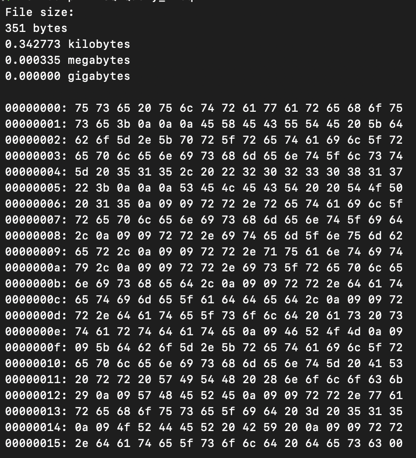

## Hex Dump a file

Dumps Hex output to specific file

### How to use

Build then execute

```
go build hex-dump.go
```

```
./hex-dump -f <input_file_path>
```

#### OR

Install executable in `PATH`

```
 go install hex-dump.go
```

```
hex-dump -f <input_file_path>
```

#### Output


